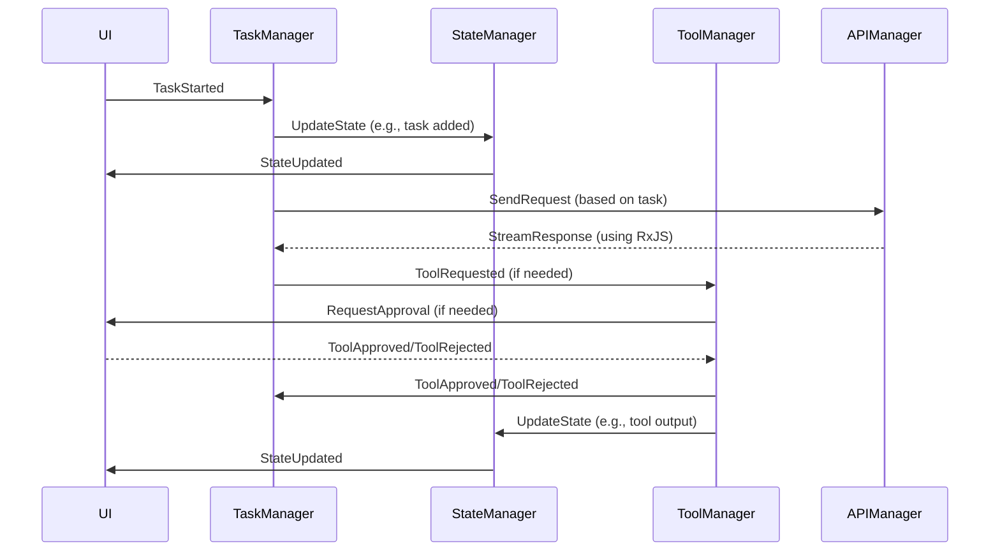

# Recline Core Refactor: Towards a Decentralized, Event-Driven Architecture

## Overview

This document outlines a plan to refactor Recline's core into a decentralized, event-driven system using RxJS. This modernization will enhance maintainability, testability, and performance, while fostering a modular and extensible codebase. **Crucially, this refactor will address known issues in the existing codebase, particularly its reliance on arbitrary waits, improper promise handling, and inadequate cleanup/state management.**

## Challenges in the Current Architecture

The existing codebase, primarily within `Recline.ts` and `ReclineProvider.ts`, suffers from several limitations:

1. **Monolithic Design**: These files are overly responsible, handling diverse concerns in a tightly coupled manner.
2. **Complex State Management**: Application state is fragmented across multiple properties and methods, making it difficult to track and manage. **Furthermore, the current implementation relies on the garbage collector for cleanup, which is unacceptable and leads to resource leaks and instability.**
3. **Tight Coupling**: UI elements, tools, and core logic are heavily intertwined, hindering independent modification and testing.
4. **Convoluted Asynchronous Control Flow**: Extensive use of chained promises and async/await, **combined with a large number of floating promises (not properly awaited),** makes the execution flow challenging to follow and debug. **The heavy use of `pWaitFor` and `delay` functions is a symptom of this core issue and will be eliminated.**
5. **Inconsistent Error Handling**: Error boundaries are not clearly defined, leading to complex error recovery logic.
6. **Testing Difficulties**: The large size of classes and their numerous dependencies make unit testing a significant hurdle.

## Proposed Architecture: Event-Driven and Decentralized

We will transition to an event-driven architecture, promoting loose coupling and clear separation of concerns. RxJS will be the backbone of this system, enabling efficient asynchronous data flow and reactive state management. **This approach will naturally eliminate the need for arbitrary waits by allowing components to react to events as they occur.**

### 1. Directory Structure

```
src/extension/core/
├── events/             # Event definitions and types (think of these as the "language" of our system)
├── state/             # Centralized, reactive state management using RxJS
├── services/          # Core services (e.g., StateManager, TaskManager, ToolManager, APIManager)
├── tools/             # Individual tool implementations, each emitting/reacting to events
├── tasks/             # Task management logic and interfaces
├── providers/         # Abstractions for API providers, facilitating easy swapping and configuration
├── compatibility/     # A temporary layer to ensure smooth transition from the legacy system
└── utils/            # Shared utility functions
```

### 2. Event Taxonomy

Events will be the primary means of communication within the system. Key event categories include:

*   **Task Events**
    *   `TaskStarted`
    *   `TaskCompleted`
    *   `TaskCancelled`
    *   `TaskFailed`
*   **Tool Events**
    *   `ToolRequested`
    *   `ToolApproved`
    *   `ToolRejected`
    *   `ToolExecuting`
    *   `ToolCompleted`
    *   `ToolFailed`
*   **State Events**
    *   `StateUpdated`
    *   `StatePersisted`
    *   `StateRestored`
*   **UI Events**
    *   `UIMessageReceived`
    *   `UIMessageSent`
    *   `UIStateUpdated`

### 3. Core Services

#### StateManager

*   **Responsibilities**:
    *   Manages the global application state using RxJS Observables.
    *   Handles state persistence and restoration.
    *   Emits `StateUpdated` events upon changes.
    *   Provides a clear API for accessing and modifying the state.
    *   **Explicitly manages subscriptions and resources, ensuring proper cleanup.**
*   **Approach**:
    *   Leverage RxJS `BehaviorSubject` or `ReplaySubject` for the central state store.
    *   Implement persistence using VS Code's `Memento` API.
    *   **Utilize `takeUntil` or similar operators to automatically unsubscribe from Observables when components are disposed of.**

#### TaskManager

*   **Responsibilities**:
    *   Orchestrates the lifecycle of tasks.
    *   Manages a task queue (if needed) and handles task execution.
    *   Tracks task history.
    *   Coordinates interactions between tools and the UI based on task progress.
    *   **Ensures that all task-related resources are properly cleaned up upon task completion or cancellation.**
*   **Approach**:
    *   Listen for `TaskStarted` events and create corresponding task objects.
    *   Emit task-related events (`TaskCompleted`, `TaskFailed`, etc.).
    *   Maintain a task history using VS Code's `Memento` or a dedicated storage mechanism.
    *   **Implement `Task` objects with a `dispose()` method to handle cleanup, and ensure this method is called when tasks are finished.**

#### ToolManager

*   **Responsibilities**:
    *   Provides a decentralized tool registry.
    *   Handles tool discovery, registration, and approval workflows.
    *   Coordinates tool execution based on `ToolRequested` events.
    *   Manages tool state and results.
    *   **Guarantees that tool subscriptions and resources are properly managed and disposed of.**
*   **Approach**:
    *   Implement a `ToolRegistry` that tools can register with.
    *   Listen for `ToolRequested` events, trigger approval flows (if necessary), and emit `ToolApproved` or `ToolRejected` events.
    *   Tools themselves will listen for `ToolApproved` and emit `ToolExecuting`, `ToolCompleted`, or `ToolFailed` events.
    *   Each tool will be responsible for managing its own internal state **and implementing a `dispose()` method for cleanup.**
    *   **The `ToolManager` will ensure that tool `dispose()` methods are called when tools are unregistered or when the extension is deactivated.**

#### APIManager

*   **Responsibilities**:
    *   Abstracts interactions with external API providers.
    *   Manages API provider configurations.
    *   Handles API request construction, execution, response parsing, rate limiting, and retries.
    *   Coordinates streaming responses using RxJS Observables.
    *   **Ensures proper resource management for API connections and subscriptions.**
*   **Approach**:
    *   Define a clear interface for API providers.
    *   Implement provider-specific logic for authentication, request formatting, etc.
    *   Use RxJS operators like `retryWhen` and `throttleTime` for robust error handling and rate limiting.
    *   **Leverage RxJS `finalize` or `takeUntil` operators to close connections and clean up resources when API interactions are complete.**

### 4. Illustrative Event Flow

This sequence diagram demonstrates how the components interact via events:



### 5. Compatibility Layer for Gradual Migration

To ensure a smooth transition, we will introduce a compatibility layer. This layer will present the original `Recline` and `ReclineProvider` interfaces to the existing codebase while internally utilizing the new event-driven architecture.

#### CompatibilityRecline

```typescript
class CompatibilityRecline implements IRecline {
  private subscriptions: Subscription[] = []; // Track subscriptions for cleanup

  constructor(
    provider: ReclineProvider,
    apiConfig: ApiConfiguration,
    autoApprovalSettings: AutoApprovalSettings,
    customInstructions?: string
  ) {
    // Initialize this facade with the new architecture's components
    // but maintain the original public interface for backward compatibility.

    // Example of proper subscription management:
    const stateUpdateSub = this.stateManager.state$.pipe(
        takeUntil(this.destroy$) // Automatically unsubscribe when destroy$ emits
      ).subscribe(//...);
    this.subscriptions.push(stateUpdateSub);
  }

  // Implement all original public methods, but delegate their functionality
  // to the new event-driven system internally.

  dispose() {
    // Ensure all subscriptions are cleaned up.
    this.subscriptions.forEach(sub => sub.unsubscribe());
    this.destroy$.next(); // Signal that this component is being destroyed
    this.destroy$.complete();
  }

  private destroy$ = new Subject<void>(); // Used to signal component destruction
}
```

#### CompatibilityReclineProvider

```typescript
class CompatibilityReclineProvider implements IReclineProvider {
  // Similar approach to CompatibilityRecline: maintain the original interface
  // while using the new architecture internally.
  // Also ensure proper subscription management and implement a dispose() method.
}
```

## Addressing Key Issues

1. **Elimination of Arbitrary Waits**: The event-driven architecture, by its nature, removes the need for `pWaitFor` and `delay`. Components will react to events emitted by other parts of the system, ensuring proper synchronization without polling or timeouts.

2. **Proper Promise Handling**: All asynchronous operations will be properly awaited using `async/await` or handled using RxJS operators. **Floating promises will be strictly prohibited.**

3. **Robust Cleanup and State Management**:
    *   Each service and tool will be responsible for managing its own resources and subscriptions.
    *   **The `dispose()` pattern will be enforced for all components that manage resources.**
    *   RxJS operators like `takeUntil`, `finalize`, and `unsubscribe` will be used to ensure proper cleanup when components are no longer needed.
    *   VS Code's lifecycle events (e.g., `onDidDispose`, `onDidChangeConfiguration`) will be properly handled to trigger cleanup actions.

## Implementation Phases

### Phase 1: Foundation - Core Event System and State Management

1. **RxJS Setup**: Integrate RxJS and establish core infrastructure for event handling.
2. **Event Definitions**: Define event types and associated data structures.
3. **StateManager**: Implement the `StateManager` with reactive state management **and robust cleanup logic.**
4. **Service Skeletons**: Create basic structures for `TaskManager`, `ToolManager`, and `APIManager`, **including `dispose()` methods.**

### Phase 2: Core Services - Building the Engine

1. **TaskManager**: Implement task lifecycle management and event emission, **paying close attention to resource management and cleanup.**
2. **ToolManager**: Develop the tool registry, approval workflow, and event handling, **enforcing the `dispose()` pattern for tools.**
3. **APIManager**: Implement API provider abstraction, request handling, and streaming, **with careful management of API connections and subscriptions.**

### Phase 3: Tool Migration - Decentralizing Functionality

1. **Individual Tool Refactoring**: Migrate each existing tool to the new architecture, making them event-driven **and adding `dispose()` methods for cleanup.**
2. **Tool-Specific Events**: Define and implement events specific to each tool.
3. **Tool Interaction**: Refactor tool interactions to use the `ToolManager` and events.

### Phase 4: Compatibility Layer - Bridging the Old and New

1. **Compatibility Classes**: Implement `CompatibilityRecline` and `CompatibilityReclineProvider`, **ensuring proper subscription management and implementing `dispose()` methods.**
2. **Event Mapping**: Map events to legacy method calls within the compatibility layer.

### Phase 5: UI Integration - Reactive User Interface

1. **WebView Messaging**: Update WebView message handling to use the new event system.
2. **UI State Synchronization**: Synchronize UI state with the `StateManager` using RxJS.
3. **Progress Indicators**: Refactor progress indicators to react to task and tool events.

## Advantages of the New Architecture

1. **Improved Maintainability**: Clear separation of concerns and a modular design make the codebase easier to understand and modify.
2. **Enhanced Testability**: Smaller, focused components with well-defined interfaces are significantly easier to unit test.
3. **Increased Performance**: RxJS enables efficient, reactive state updates and fine-grained control over asynchronous operations.
4. **Extensibility**: Adding new features or tools becomes straightforward thanks to the decentralized, event-driven nature.
5. **Robust Error Handling**: Clearly defined event-based error boundaries simplify error handling and recovery.
6. **Streamlined Debugging**: The event-driven flow, combined with RxJS debugging tools, makes it easier to trace execution and identify issues.
7. **Elimination of Known Issues**: **The new architecture directly addresses the problems of arbitrary waits, improper promise handling, and inadequate cleanup, leading to a more stable and reliable extension.**

## Migration Strategy

1. **Parallel Implementation**: Develop the new system alongside the existing code.
2. **Compatibility Layer**: Maintain stability by routing legacy calls through the compatibility layer.
3. **Gradual Feature Migration**: Migrate features one by one to the new system, ensuring thorough testing at each step.
4. **Legacy Code Removal**: Once all features are migrated, remove the legacy code and compatibility layer.

## Next Steps

1. **Create Directory Structure**: Set up the new directory structure as outlined in this plan.
2. **RxJS and Core Events**: Integrate RxJS and define the initial set of core events.
3. **StateManager Implementation**: Begin building the `StateManager`, **focusing on robust cleanup and resource management.**
4. **Compatibility Layer Foundation**: Start implementing the basic structure of the compatibility layer, **including subscription management and the `dispose()` pattern.**
