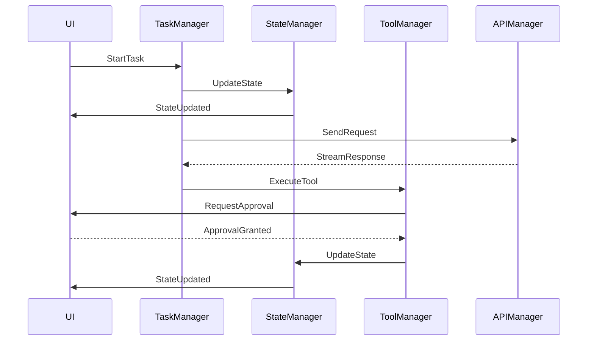

# Recline Core Reimplementation Plan

## Overview
We will refactor Recline's monolithic core into a decentralized event-driven system using RxJS. This will improve maintainability, testability, and performance while making the codebase more modular and easier to extend.

## Current Architecture Issues
1. **Monolithic Design**: `Recline.ts` and `ReclineProvider.ts` handle too many responsibilities
2. **Complex State Management**: State is scattered across multiple properties and methods
3. **Tightly Coupled Components**: UI, tools, and core logic are intertwined
4. **Asynchronous Flow Control**: Heavy use of chained promises and async/await makes flow control difficult to follow
5. **Error Handling**: Error boundaries are unclear and error recovery is complex
6. **Testing Difficulty**: Large classes with many dependencies are hard to test

## New Architecture
We'll implement an event-driven architecture with clear boundaries between components:

### 1. Core Components

```
src/extension/core/
├── events/             # Event definitions and types
├── state/             # State management
├── services/          # Core services
├── tools/             # Tool implementations
├── tasks/             # Task management
├── providers/         # API provider abstraction
├── compatibility/     # Legacy compatibility layer
└── utils/            # Shared utilities
```

### 2. Key Events
- **Task Events**
  - TaskStarted
  - TaskCompleted
  - TaskCancelled
  - TaskFailed

- **Tool Events**
  - ToolRequested
  - ToolApproved
  - ToolRejected
  - ToolExecuting
  - ToolCompleted
  - ToolFailed

- **State Events**
  - StateUpdated
  - StatePersisted
  - StateRestored

- **UI Events**
  - UIMessageReceived
  - UIMessageSent
  - UIStateUpdated

### 3. Core Services

#### StateManager
- Manages application state
- Handles persistence
- Emits state change events
- Provides state access APIs

#### TaskManager
- Creates and manages task lifecycles
- Handles task queueing and execution
- Manages task history
- Coordinates between tools and UI

#### ToolManager
- Manages tool registration and discovery
- Handles tool approval workflows
- Coordinates tool execution
- Manages tool state and results

#### APIManager
- Handles API provider configuration
- Manages API requests and responses
- Handles rate limiting and retries
- Coordinates streaming responses

### 4. Event Flow Example



### 5. Compatibility Layer
To ensure a smooth transition, we'll create two compatibility classes that implement the original interfaces but use the new event-driven system internally:

#### CompatibilityRecline
```typescript
class CompatibilityRecline implements IRecline {
  constructor(
    provider: ReclineProvider,
    apiConfig: ApiConfiguration,
    autoApprovalSettings: AutoApprovalSettings,
    customInstructions?: string
  ) {
    // Initialize with new architecture components
    // but maintain original public interface
  }

  // Implement all original public methods but use
  // new event system internally
}
```

#### CompatibilityReclineProvider
```typescript
class CompatibilityReclineProvider implements IReclineProvider {
  // Similar approach to CompatibilityRecline
}
```

## Implementation Phases

### Phase 1: Core Event System
1. Set up RxJS infrastructure
2. Define core events and types
3. Implement state management
4. Create basic service skeletons

### Phase 2: Core Services
1. Implement StateManager
2. Implement TaskManager
3. Implement ToolManager
4. Implement APIManager

### Phase 3: Tool Migration
1. Migrate each tool to new architecture
2. Add tool-specific events
3. Implement tool approval workflow
4. Add tool result handling

### Phase 4: Compatibility Layer
1. Implement CompatibilityRecline
2. Implement CompatibilityReclineProvider
3. Add event-to-legacy mappings

### Phase 5: UI Integration
1. Update WebView message handling
2. Implement UI event system
3. Add state synchronization
4. Update progress indicators

## Benefits
1. **Improved Maintainability**: Clear separation of concerns and modular design
2. **Better Testing**: Smaller, focused components are easier to test
3. **Enhanced Performance**: More efficient state updates and better resource management
4. **Easier Extensions**: Well-defined interfaces for adding new features
5. **Better Error Handling**: Clear error boundaries and recovery paths
6. **Improved Debug Experience**: Event tracing makes issues easier to track

## Migration Strategy
1. Implement new system alongside existing code
2. Use compatibility layer to maintain stability
3. Gradually migrate features to new system
4. Remove legacy code once migration is complete

## Next Steps
1. Create new directory structure
2. Set up RxJS and define core events
3. Begin implementing StateManager
4. Start building compatibility layer
